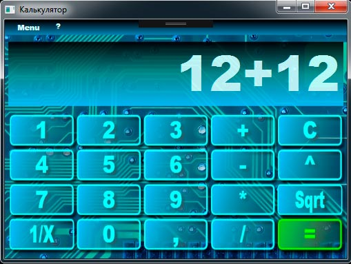

# CalculatorApp

## Description

This is a simple calculator app with a GUI. It was written from scratch using C#, WPF and the MVVM pattern. The app implements basic mathematical operations, a bit of animation and a few themes.

## How To Use

1. Build this project, using the **Solution Explorer -> Build Solution** by right-clicking on the **Solution Explorer**.

2. Run the created executable file (**CalculatorApp.exe**).

## Screenshots

## Licence

[MIT License](https://github.com/artgl42/CalculatorApp/blob/master/LICENSE) Copyright (c) 2020 Artem Glushkov
